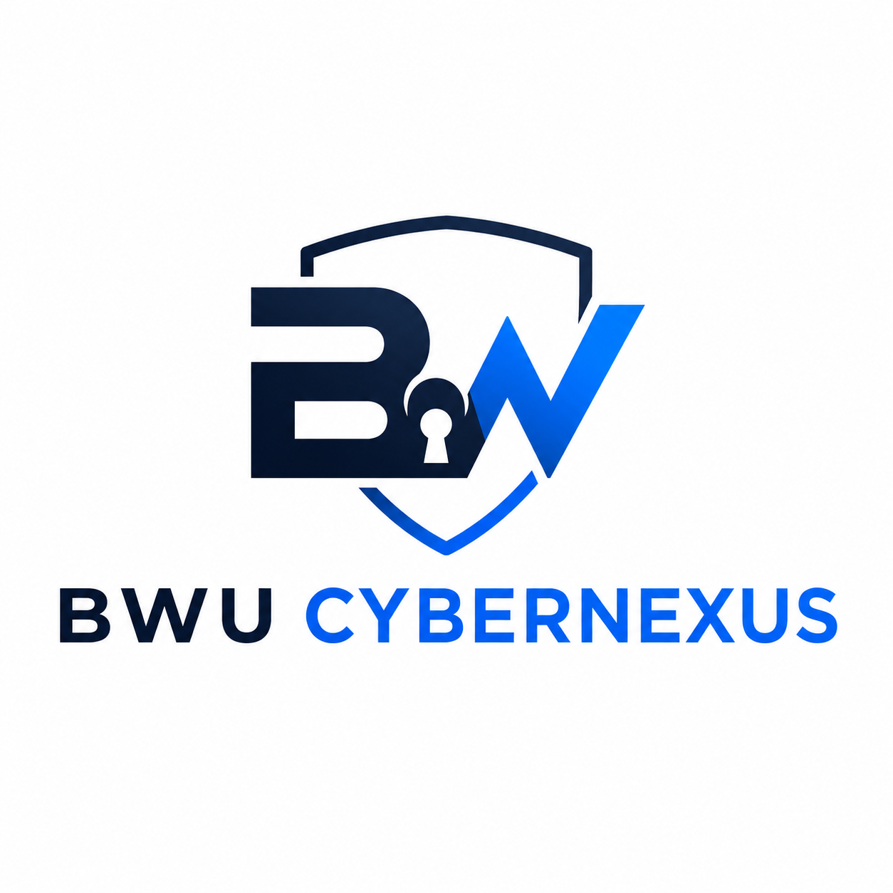

# SIH2026 - The Open Source

## Project Details:
* __PS Number__: SIH26047
* __PS Title__: Patient Case-Taking Software
* __Category__: Software
* __Theme__: MedTech / BioTech / HealthTech

### Assigned Group Name for this Project: BWU CyberNexus

## Official Members (GitHub Profiles):
1. BWU/BCC/24/040 - [Pranay Das Adhikary](https://github.com/Pranaydasadhikary)
2. BWU/BCC/24/035 - [Subhankit Dam](https://github.com/SubhankitDam)
3. BWU/BCC/24/085 - [Subhajit Dhang](https://github.com/Subhajitdhang)
4. BWU/BCC/24/086 - [Sudip Kumar Banerjee](https://github.com/SudipKr-Banerjee)
5. BWU/BCC/24/039 - [Samir Kandu](https://github.com/samirkandu636-lab)
6. BWU/BTA/24/452 - [Manusri Karmakar](https://github.com/Manusri-5)
